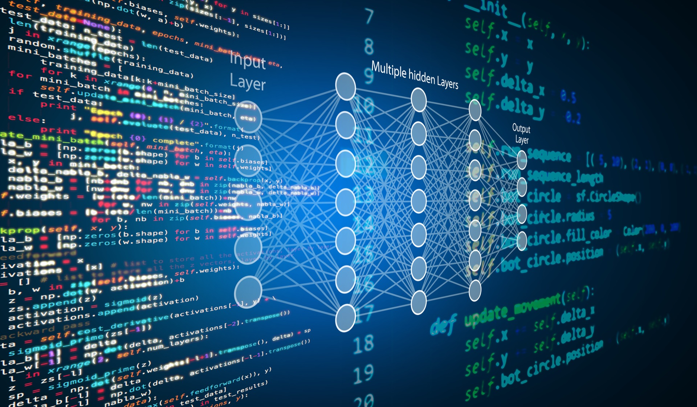

# Datascience-Formation-OpenClassroom
Répertoire de synthèse de ma formation Datascientist OpenClassroom

Après 3 ans et demi d'expérience dans l'ESN SII, j'ai décidé de me spécialiser dans la data science au travers la formation [certifiante](https://www.francecompetences.fr/recherche/rncp/37431/#ancre7) de l'organisme Openclassrooms.
Cette formation de euf mois, à temps plein et à distance, m'a permis d'acquérir un large spectre de comptétences ave une grande autonomie aux outils de la datascience.

### Parmi les différentes activités de cette formation, on retrouve : 

**Collecter, pré-traiter et analyser des données et créer des variables pertinentes (feature engineering) pour l'entraînement d’un modèle**
Définition de la stratégie de collecte de données et réalisation d’une collecte via une API
Définition et gestion du nettoyage de données structurées
Réalisation d’analyses statistiques et de représentations graphiques de données structurées
Conception et adaptation de variables pertinentes pour les modèles d’apprentissage (feature engineering)

**Concevoir des modèles d'apprentissage à partir de données structurées et de données non structurées (texte et images)**
Définition et mise en oeuvre de la stratégie d’élaboration d’un modèle d’apprentissage supervisé avec des données structurées, pour réaliser une analyse prédictive
Définition et mise en oeuvre de la stratégie d’élaboration d’un modèle d’apprentissage non supervisé avec des données structurées, pour segmenter ou réduire des données
Définition et mise en oeuvre de la stratégie d’élaboration d’un modèle d’apprentissage profond (deep learning) pour réaliser une analyse prédictive

**Gérer le cycle de vie et le déploiement en production d’un modèle (MLOps) ou d’une application dans des environnements classiques et Big Data**
Gestion du cycle de vie et déploiement continu en production d'un modèle dans le cadre d'une démarche orientée MLOps
Conception, préparation, et déploiement d’une application ou d’un modèle d’apprentissage en utilisant les technologies du big data

**Manager des projets IA et de data science complexes en intégrant les contraintes légales et les valeurs d’éthique**
Réalisation d’une veille sur les outils et tendances en data science et IA
Organisation de l'expression du besoin des métiers et formalisation de user stories
Cadrage et gestion d’un projet IA ou de data science, selon une approche agile de type SCRUM
Présentation des projets de data science et restitution des résultats aux métiers

### Chaque projet apporte des compétences supplémentaires, voici la liste :
* [Projet 2](https://openclassrooms.com/fr/projects/1499) : Analysez des données de systèmes éducatifs
* [Projet 3](https://openclassrooms.com/fr/projects/1500) : Préparez des données pour un organisme de santé publique
* [Projet 4](https://openclassrooms.com/fr/projects/1501) : Anticipez les besoins en consommation de bâtiments
* [Projet 5](https://openclassrooms.com/fr/projects/1502) : Segmentez des clients d'un site e-commerce
* [Projet 6](https://openclassrooms.com/fr/projects/1503) : Classifiez automatiquement des biens de consommation
* [Projet 7](https://openclassrooms.com/fr/projects/1504) : Implémentez un modèle de scoring
* [Projet 8](https://openclassrooms.com/fr/projects/1505) : Réalisez un dashboard et assurez une veille technique
* [Projet 9](https://openclassrooms.com/fr/projects/1506) : Réalisez un traitement dans un environnement Big Data sur le Cloud
* [Projet 10](https://openclassrooms.com/fr/projects/1507) : Réalisez le cadrage d’un projet IA
